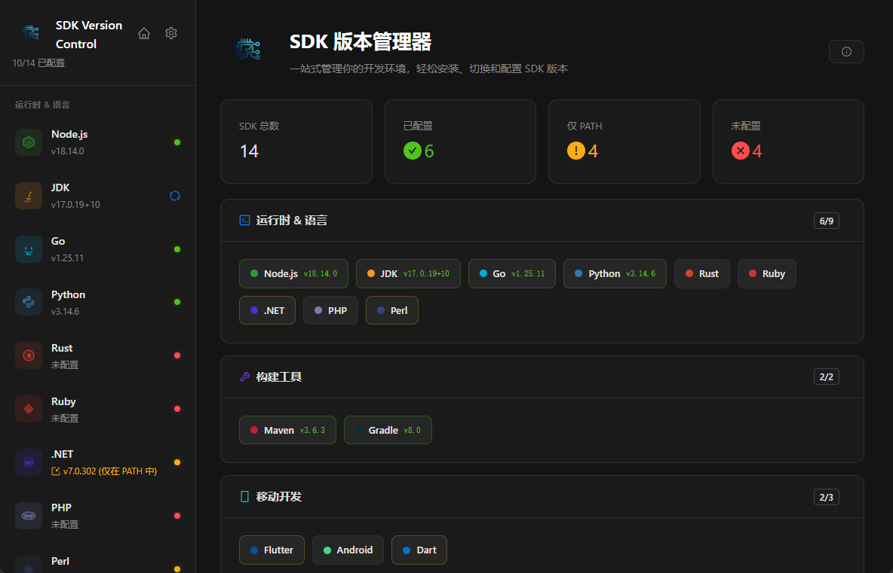
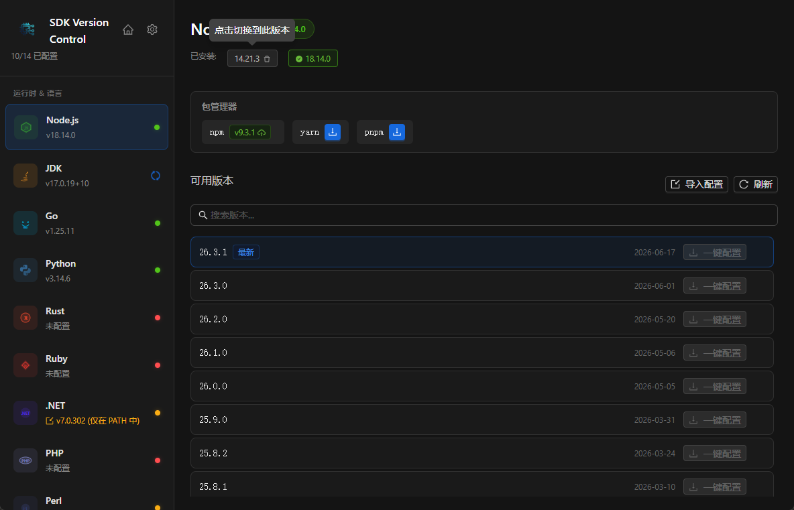
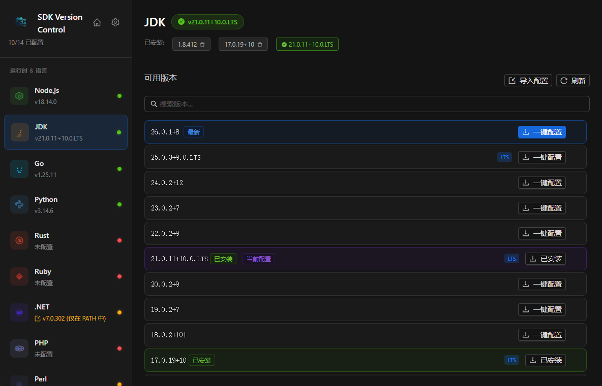
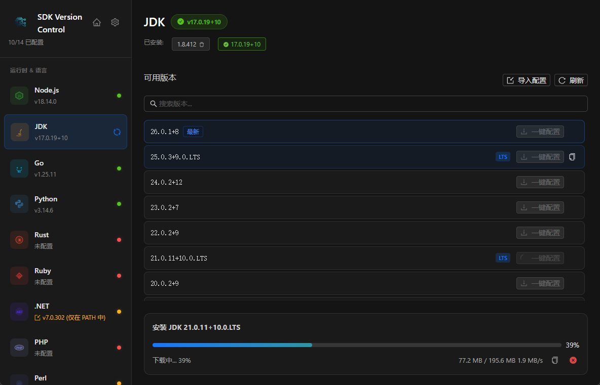
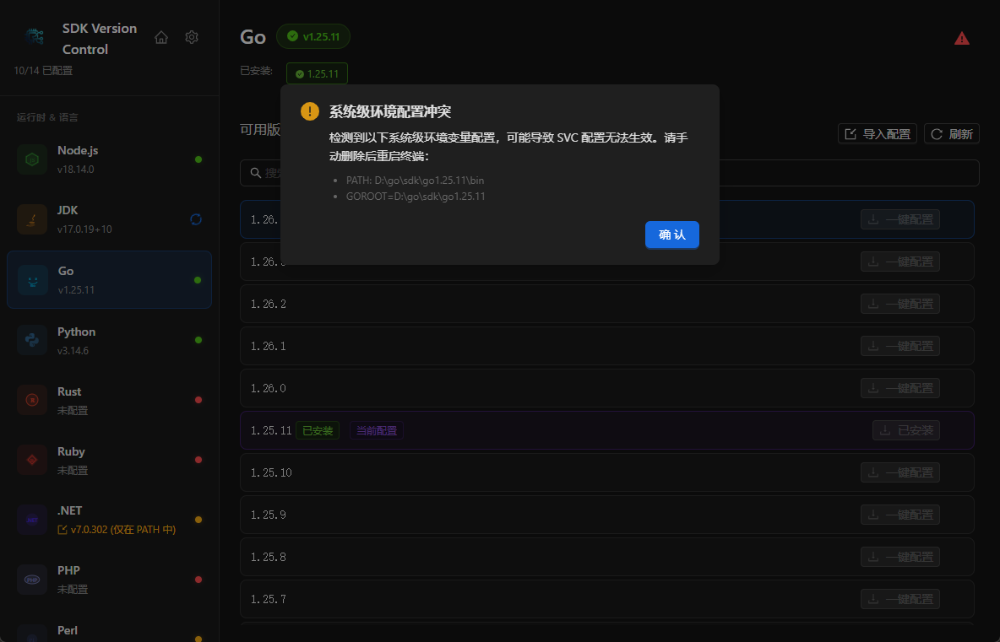
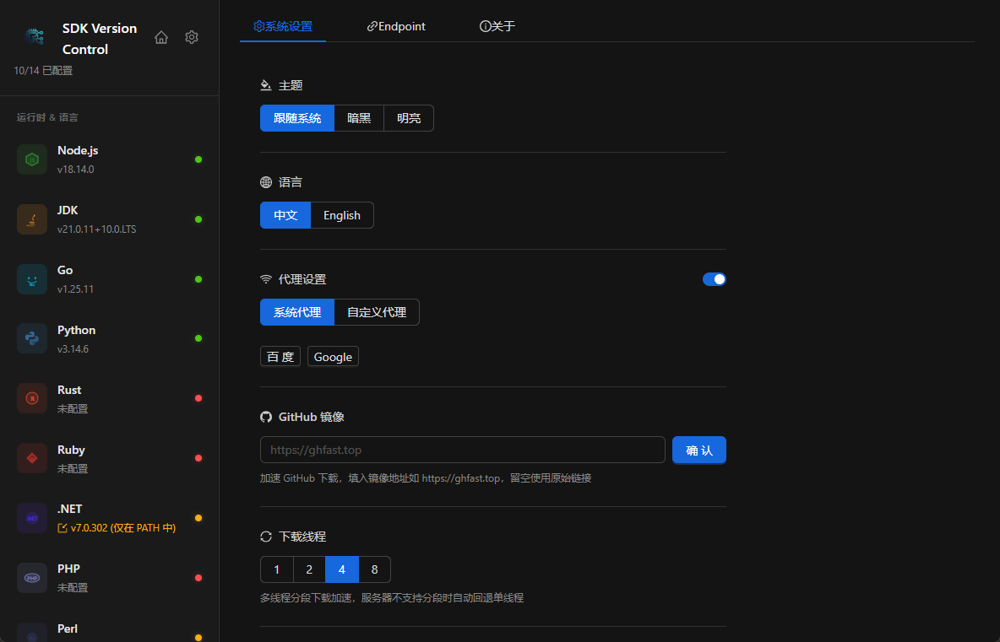

# SDK Version Control

一个跨平台桌面应用，用于统一管理多种 SDK（Node.js、JDK、Go、Python、Rust 等）的版本安装、切换和环境变量配置。

## 功能特性

### SDK 管理
- **支持 18 种 SDK**：Node.js、JDK、Go、Python、Rust、Ruby、.NET、PHP、Perl、Maven、Gradle、Flutter、Android、Dart 等
- **一键安装**：从官方源获取可用版本列表，一键下载安装
- **版本切换**：已安装版本可快速切换，无需重新下载
- **重新安装**：已安装版本支持覆盖安装
- **导入配置**：支持从本地压缩包或文件夹导入已有 SDK

### 包管理器
- 自动检测并安装各 SDK 对应的包管理器（npm、yarn、pnpm、pip、gem、cargo 等）
- 支持包管理器版本更新

### 环境配置
- **自动 PATH 管理**：安装/切换版本后自动配置系统环境变量
- **自定义安装位置**：支持自定义 SDK 存储目录，迁移时自动更新 PATH
- **PATH 信息查看**：可视化查看当前 PATH 中的 SDK 相关条目

### 系统设置
- **主题切换**：暗色/亮色/跟随系统，窗口标题栏同步变色
- **多语言**：中文 / English
- **代理配置**：支持系统代理或自定义代理
- **Endpoint 自定义**：各 SDK 下载源可配置自定义端点
- **自动更新**：基于 OSS 托管的 version.json 实现应用内更新

### 用户体验
- **下载进度**：实时显示下载速度、进度和剩余大小
- **复制下载链接**：支持复制 SDK 下载 URL
- **二次确认**：敏感操作（切换版本、重装、迁移目录等）均需确认弹窗
- **状态指示**：侧栏彩色圆点标识各 SDK 配置状态（绿色=已配置，黄色=仅PATH，红色=未配置）

### 使用案例
#### 主页

#### Node.js

#### Jdk

#### 一键导入安装

#### 非SVC管理提示

#### 设置



## 技术栈

- **后端**：Go 1.25 + Wails v2
- **前端**：React + TypeScript + Vite + Ant Design
- **桌面框架**：Wails v2 (WebView2)

## 项目结构

```
sdk_version_control/
├── main.go                    # 入口
├── app.go                     # Wails App 绑定
├── about.json                 # 应用信息（版本、协议等）
├── internal/
│   ├── config/                # 配置管理（settings、install path）
│   ├── downloader/            # HTTP 下载器（支持代理）
│   ├── extractor/             # 压缩包解压（zip、tar.gz、7z 等）
│   ├── pathmgr/               # PATH 环境变量管理
│   └── sdk/                   # 各 SDK 的版本获取、安装逻辑
├── frontend/
│   ├── src/
│   │   ├── App.tsx            # 主组件
│   │   ├── components/        # Sidebar、DetailPanel、Settings 等
│   │   ├── i18n/              # 国际化文件
│   │   └── types/             # TypeScript 类型定义
│   └── wailsjs/               # Wails 自动生成的绑定
└── build/                     # 构建产物
```

## 数据存储

- **SDK 安装目录**：默认 `~/.svc/`（可自定义），结构为 `~/.svc/{sdk-type}/{version}/`
- **应用配置**：`~/.svc/settings.json`（主题、语言、代理、端点等）

## 开发

### 环境要求
- Go 1.25+
- Node.js 18+
- Wails CLI: `go install github.com/wailsapp/wails/v2/cmd/wails@latest`

### 启动开发服务器

```bash
wails dev
```

### 构建

```bash
# 当前平台
wails build

# 指定输出文件名
wails build -o SDKVersionControl.exe
```

### 跨平台打包

Wails v2 不支持交叉编译，需要在目标平台上分别构建：

**Windows:**
```bash
wails build
```

**macOS:**
```bash
brew install wailsio/wails/wails
wails build
```

**Linux (Ubuntu/Debian):**
```bash
sudo apt install libgtk-3-dev libwebkit2gtk-4.0-dev
wails build
```

## 自动更新机制

在 OSS 上维护 `version.json`：

```json
{
  "version": "0.2.0",
  "changelog": "1. 新增XX功能\n2. 修复XX问题",
  "downloads": {
    "windows-amd64": {
      "url": "https://bucket.oss.com/releases/app_0.2.0_windows_amd64.exe",
      "filename": "app_0.2.0_windows_amd64.exe"
    },
    "darwin-amd64": { "url": "...", "filename": "..." },
    "darwin-arm64": { "url": "...", "filename": "..." },
    "linux-amd64": { "url": "...", "filename": "..." }
  }
}
```

应用内点击「检查更新」即可检测新版本，支持应用内下载并自动重启替换。

## License

MIT License
