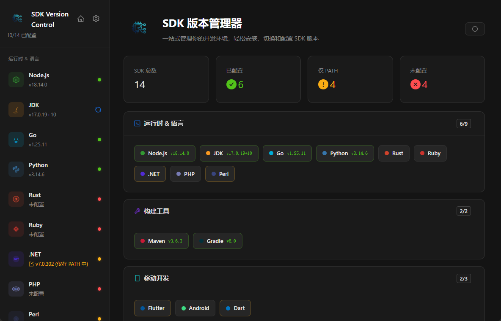
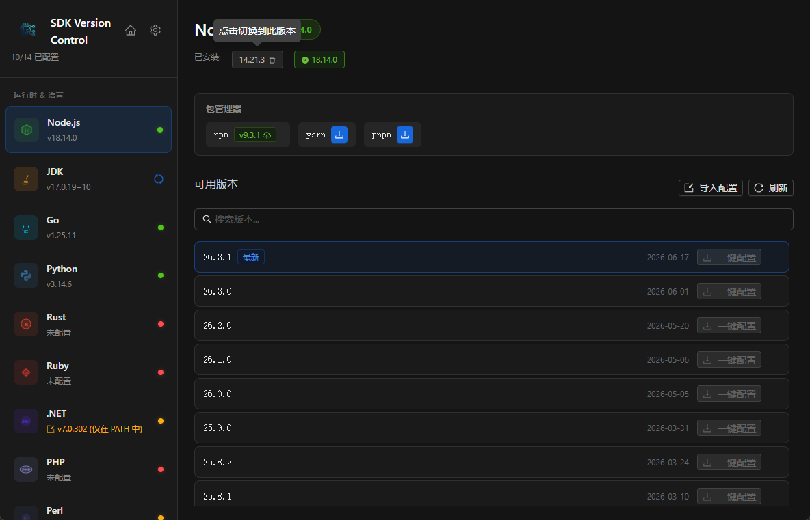
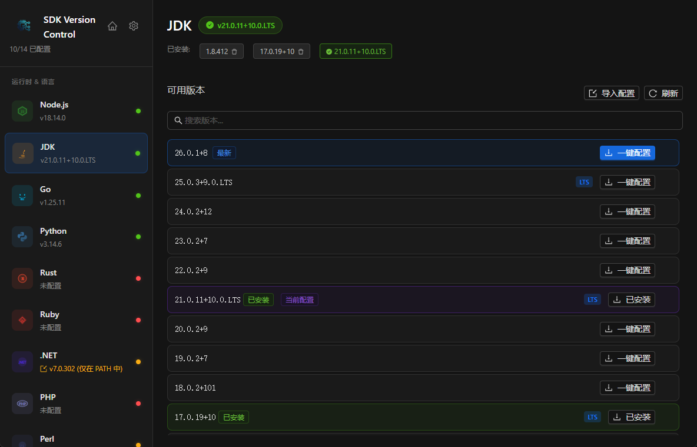
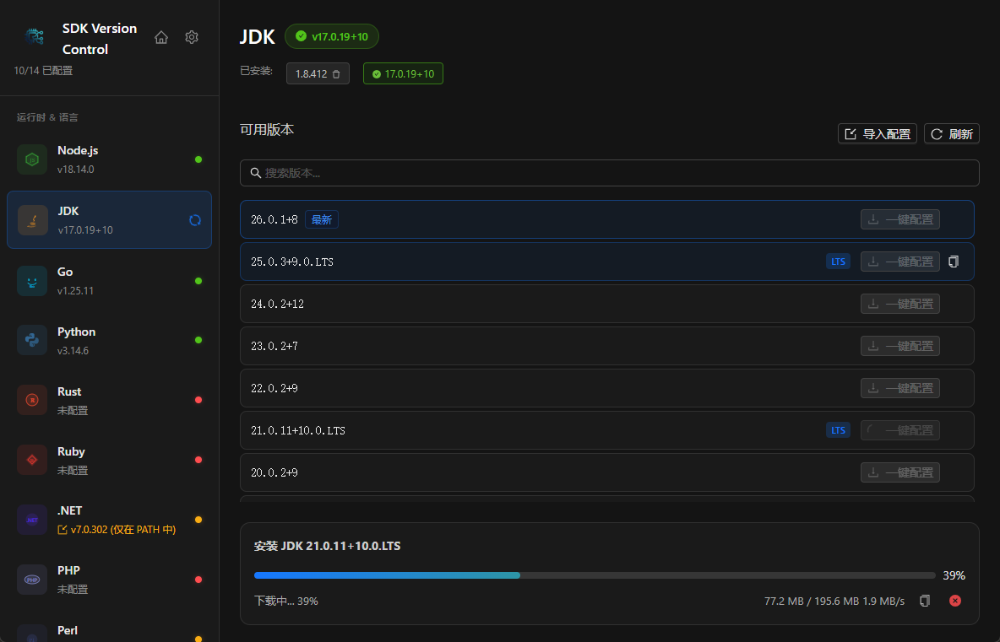
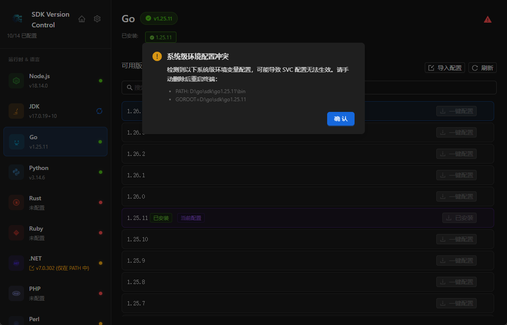
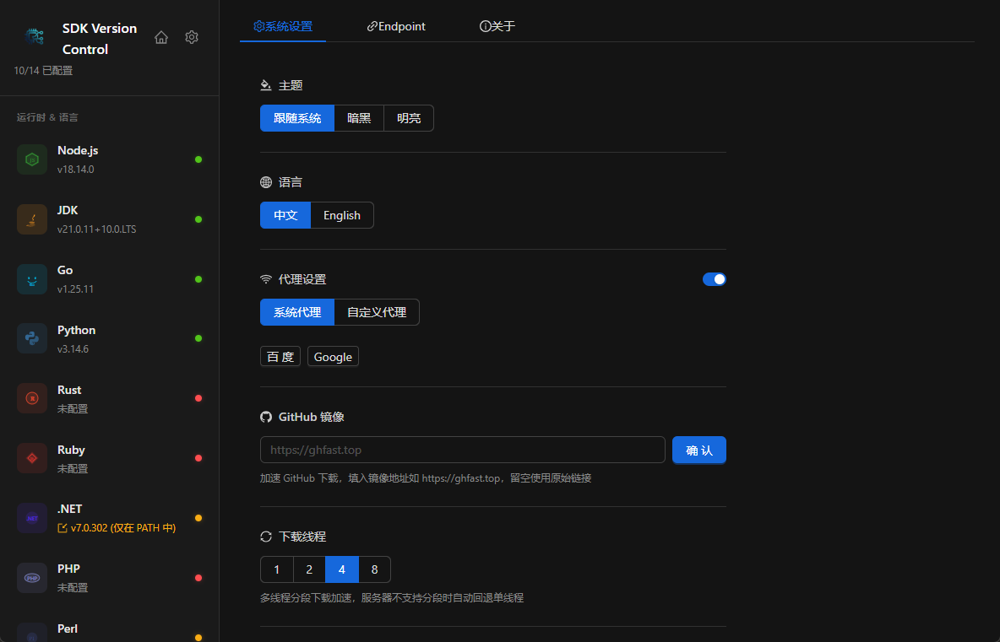

# SDK Version Control

一个跨平台桌面应用，用于统一管理多种 SDK（Node.js、JDK、Go、Python、Rust 等）的版本安装、切换、环境变量配置，以及带完整性校验的应用内自更新。

[English Documentation](README.md)

## 功能特性

### SDK 管理
- **支持 18 种 SDK**：Node.js、JDK、Go、Python、Rust、Ruby、.NET、PHP、Perl、Maven、Gradle、Flutter、Android、Dart 等
- **一键安装**：从官方源获取可用版本列表，一键下载安装
- **版本切换**：已安装版本可快速切换，无需重新下载
- **重新安装**：已安装版本支持覆盖安装
- **导入配置**：支持从本地压缩包、文件夹导入，或一键导入 PATH 中检测到的 SDK

### Shim 机制
- 为多 bin 目录的 SDK 自动生成 shim（如 Rust 的 `cargo/bin` + `rustc/bin`）
- 透明路由命令到当前激活版本，不污染 PATH
- 跨平台 shim 执行器（Unix shell 脚本 + Windows 批处理）

### 包管理器
- 自动检测并安装各 SDK 对应的包管理器（npm、yarn、pnpm、pip、gem、cargo 等）
- 支持包管理器版本更新

### 环境配置
- **自动 PATH 管理**：安装/切换版本后自动配置系统环境变量
- **自定义安装位置**：支持自定义 SDK 存储目录，迁移时自动更新 PATH 并备份到桌面
- **PATH 信息查看**：可视化查看当前 PATH 中的 SDK 相关条目，检测系统级环境变量冲突
- **Shell RC 编辑**：自动编辑 `.bashrc`/`.zshrc`/`.profile`/PowerShell profile 让 shim 生效

### 系统设置
- **主题切换**：暗色/亮色/跟随系统，窗口标题栏同步变色
- **多语言**：中文 / English
- **代理配置**：支持系统代理或自定义代理，可测试连通性（百度 / Google）
- **GitHub 镜像**：通过可配置镜像加速 GitHub 下载（如 `https://ghfast.top`）
- **下载线程**：多线程分段下载，服务器不支持 range 时自动回退单线程
- **Endpoint 自定义**：各 SDK 下载源可配置自定义端点
- **缓存清理**：一键清理临时下载缓存和未激活的 SDK 版本
- **日志管理**：应用内查看、搜索、清理日志

### 应用内自更新（v1.0.0 起）
- **GitHub Releases**：检测、下载、应用更新全程在应用内完成，无需手动重装
- **SHA256 校验**：下载的二进制在替换前会与发布的校验和比对；损坏或被篡改的产物会被拒绝并删除
- **一次性回滚**：每次升级会备份上一版本到 `<exe>.bak`；应用内「回滚」按钮可恢复到紧邻的上一版本
- **跨平台替换**：Unix 用 shell 脚本（`pgrep` 等待 → 备份 → 替换 → 重启）；Windows 用批处理脚本（`tasklist` 等待 → 备份 → 替换 → 重启）处理运行中二进制锁
- **产物命名**：`SDKVersionControl-{version}-{os}-{arch}.{ext}`（amd64 → x64），每个 release 附带独立的 `sha256sums.txt`

### 用户体验
- **下载进度**：实时显示下载速度、进度和剩余大小
- **复制下载链接**：支持复制 SDK 下载 URL
- **二次确认**：敏感操作（切换版本、重装、迁移目录、回滚等）均需确认弹窗
- **状态指示**：侧栏彩色圆点标识各 SDK 配置状态（绿色=已配置，黄色=仅PATH，红色=未配置）

### 使用案例
#### 主页

#### Node.js

#### Jdk

#### 一键导入安装

#### 非SVC管理提示

#### 设置


## 与同类工具的对比优势

| 对比项 | SVC（本项目） | nvm / sdkman / pyenv 等 | VS Code 插件 |
|---|:---:|:---:|:---:|
| SDK 统一管理（18+ 种） | ✅ | ❌ 单一 SDK | ❌ 分散 |
| 图形化界面 | ✅ | ❌ 命令行 | ✅ |
| 自动配置 PATH | ✅ | ⚠️ 需配置 shell | ❌ |
| 跨平台桌面应用 | ✅ | ✅ | ✅ |
| 多线程下载 | ✅ | ❌ | – |
| 自定义下载源 | ✅ | ⚠️ 部分支持 | – |
| GitHub 镜像加速 | ✅ | ❌ | – |
| 包管理器配套 | ✅ | ⚠️ 部分支持 | – |
| PATH 可视化 | ✅ | ❌ | ❌ |
| 一键导入 SDK（压缩包/文件夹/PATH） | ✅ | ❌ | ❌ |
| 多 bin 目录 SDK 的 Shim 机制 | ✅ | ❌ | ❌ |
| 安装位置迁移+自动备份 | ✅ | ❌ | ❌ |
| 系统级生效（所有 IDE/终端可用） | ✅ | ⚠️ 仅当前 shell | ❌ 仅 VS Code |
| 冲突检测与清理 | ✅ | ❌ | ❌ |
| 应用内自更新 + SHA256 + 回滚 | ✅ | ⚠️ 部分（无回滚） | ❌ |

### 总结

这个项目的核心优势在于 **「一站式、图形化、跨平台」** 的 SDK 版本管理体验。它解决了开发者需要安装和管理多种 SDK 版本的痛点，将原本需要通过多个命令行工具（nvm、sdkman、pyenv、rustup 等）完成的工作，统一到一个直观的桌面应用中。

不用再记每种语言的 CLI 命令，不用再折腾 shell 配置文件，不用再忍受 PATH 越来越长 —— 清爽的图形界面，在 Windows、macOS、Linux 上体验完全一致。

## 技术栈

- **后端**：Go 1.25 + Wails v2
- **前端**：React + TypeScript + Vite + Ant Design
- **桌面框架**：Wails v2（WebView2 / WebKitGTK）

## 项目结构

```
sdk_version_control/
├── main.go                    # 入口
├── app.go                     # Wails App 绑定
├── about.json                 # 应用信息（版本、协议、updateUrl）
├── update.go                  # 更新检查 + 下载 + SHA256 校验
├── update_unix.go             # Unix 二进制替换 + 回滚（.bak）
├── update_windows.go          # Windows 二进制替换 + 回滚（.bak）
├── sdk_ops.go                 # SDK 安装/切换/卸载操作
├── import_sdk.go              # 从压缩包/文件夹/PATH 导入 SDK
├── migration.go               # 安装位置迁移（带桌面备份）
├── pkgmgr.go                  # 包管理器检测与安装
├── storage.go                 # 缓存大小 + 未激活版本清理
├── logmgr.go                  # 日志文件管理
├── proxy.go                   # 代理 transport 构建
├── helpers.go                 # 杂项辅助
├── cmd_unix.go / cmd_windows.go  # 跨平台命令启动器
├── internal/
│   ├── config/                # 配置（settings、install path、shell 检测）
│   ├── downloader/            # 多线程 HTTP 下载器（支持代理）
│   ├── extractor/             # 压缩包解压（zip、tar.gz、7z 等）
│   ├── logger/                # 结构化日志
│   ├── pathmgr/               # PATH 环境变量管理（unix/windows）
│   ├── shim/                  # Shim 执行器 + 参数检测
│   ├── shimmanager/           # Shim 安装 + shell RC 编辑
│   └── sdk/                   # 各 SDK 的版本获取、安装逻辑
├── frontend/
│   ├── src/
│   │   ├── App.tsx            # 主组件
│   │   ├── components/        # Sidebar、DetailPanel、Settings 等
│   │   ├── i18n/              # en / zh 翻译文件
│   │   └── types/             # TypeScript 类型定义
│   └── wailsjs/               # Wails 自动生成的绑定
├── winres/                    # Windows 资源（图标、清单）
├── .github/workflows/
│   ├── ci.yml                 # PR 上的 lint + test + commit-lint
│   └── build.yml              # tag 推送时 6 平台构建 + 发布
└── version.json.example       # 自更新用的 version.json 示例
```

## 数据存储

- **SDK 安装目录**：默认 `~/.svc/`（可自定义），结构为 `~/.svc/{sdk-type}/{version}/`
- **Shim 目录**：`~/.svc/shims/`（加入 PATH；路由到激活版本）
- **应用配置**：`~/.svc/settings.json`（主题、语言、代理、端点等）
- **日志**：`~/.svc/logs/`
- **更新备份**：运行中二进制旁的 `<exe>.bak`（每次升级生成）

## 开发

### 环境要求
- Go 1.25+
- Node.js 18+
- Wails CLI: `go install github.com/wailsapp/wails/v2/cmd/wails@latest`
- 仅 Linux 需要：`libgtk-3-dev libwebkit2gtk-4.0-dev libayatana-appindicator3-dev librsvg2-dev`

### 启动开发服务器

```bash
wails dev
```

### 构建

```bash
# 当前平台
wails build

# 指定输出文件名
wails build -o SDKVersionControl
```

### 跨平台打包说明

Wails v2 不支持交叉编译 Linux（CGO 链接 webkit2gtk/gtk），Linux ARM64 需用 native runner。Windows ARM64 和 macOS ARM64 可在 amd64 runner 上交叉编译（无 CGO）。CI workflow [.github/workflows/build.yml](.github/workflows/build.yml) 会在 tag 推送时自动处理全部 6 个目标。

## 安装

从 [Releases](https://github.com/mose-x/sdk-version-control/releases/latest) 下载对应平台的产物：

| 平台 | 产物名 |
|---|---|
| Windows x64 | `SDKVersionControl-{ver}-windows-x64.exe` |
| Windows arm64 | `SDKVersionControl-{ver}-windows-arm64.exe` |
| macOS x64 | `SDKVersionControl-{ver}-macos-x64.dmg` |
| macOS arm64 (Apple Silicon) | `SDKVersionControl-{ver}-macos-arm64.dmg` |
| Linux x64 | `SDKVersionControl-{ver}-linux-x64` |
| Linux arm64 | `SDKVersionControl-{ver}-linux-arm64` |

用发布的校验文件验证完整性：

```bash
sha256sum -c sha256sums.txt --ignore-missing
```

## 自动更新机制

应用会检查 `https://github.com/mose-x/sdk-version-control/releases/latest/download/version.json`（配置在 [about.json](about.json)）。每个 release 附带描述各平台下载链接和 SHA256 校验和的 `version.json`，以及独立的 `sha256sums.txt`。

### 更新流程

1. **检查**：应用内「检查更新」拉取 `version.json`，按语义化版本比较。
2. **下载**：用户点「下载并安装」；新二进制下载到临时路径，实时显示进度，应用配置的 GitHub 镜像和代理。
3. **校验**：计算下载文件的 SHA256，与 `version.json` 中的值比对。不匹配则删除临时文件并中止更新（防御 CDN 篡改或下载不完整）。
4. **应用**：生成 shell/batch 脚本，等待应用退出 → 备份当前二进制到 `<exe>.bak` → 替换为新版本 → 重启。
5. **回滚**（可选）：新版本出问题时，设置页的「回滚」通过同样的等待-替换-重启模式恢复 `<exe>.bak`。一次性 —— `.bak` 始终指向紧邻的上一版本。

### version.json 格式

完整示例见 [version.json.example](version.json.example)。`downloads` 的 map key 是 `<runtime.GOOS>-<runtime.GOARCH>`（如 `windows-amd64`、`darwin-arm64`）—— Go 的 GOARCH 是 `amd64` 不是 `x64`，尽管产物文件名用 `x64`。

```json
{
  "version": "1.0.0",
  "changelog": "Release v1.0.0 — 详情见 ...",
  "downloads": {
    "windows-amd64": {
      "url": ".../SDKVersionControl-1.0.0-windows-x64.exe",
      "filename": "SDKVersionControl-1.0.0-windows-x64.exe",
      "sha256": "abc123..."
    },
    "darwin-arm64": {
      "url": ".../SDKVersionControl-1.0.0-macos-arm64.bin",
      "filename": "SDKVersionControl",
      "sha256": "def456..."
    }
  }
}
```

> macOS 自更新用 `.bin`（裸二进制），因为 `ApplyUpdate` 替换的是 `.app` bundle 内的二进制，不是 bundle 本身。`.dmg` 仅用于手动安装。

### 发布新版本

CI 全自动 —— 只需推送 tag：

```bash
git tag v1.1.0
git push origin v1.1.0
```

[build.yml](.github/workflows/build.yml) workflow 会构建全部 6 个平台产物，生成 `sha256sums.txt` 和 `version.json`，并发布非草稿 GitHub Release。应用内更新器通过 `releases/latest/download/version.json` 立即感知。

## License

MIT License
