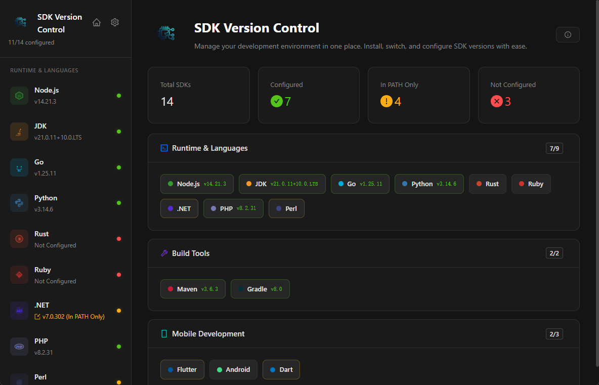
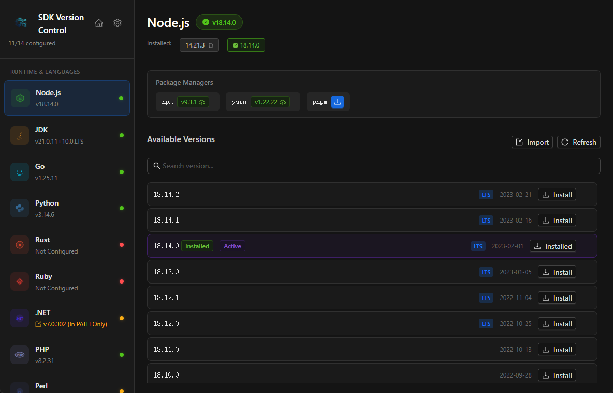
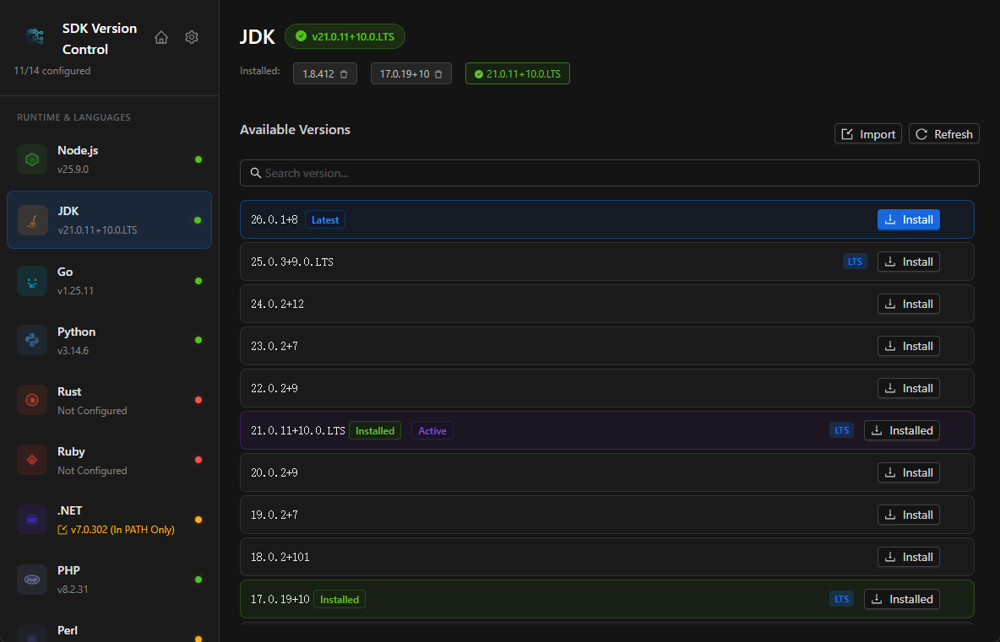
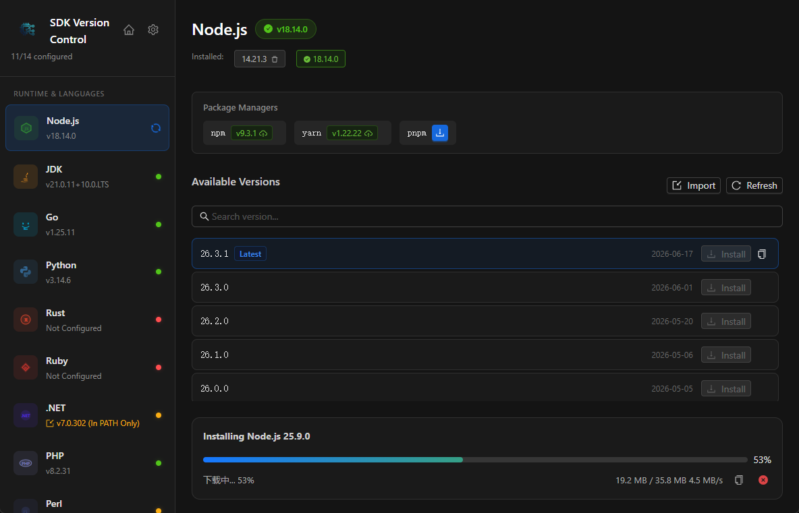
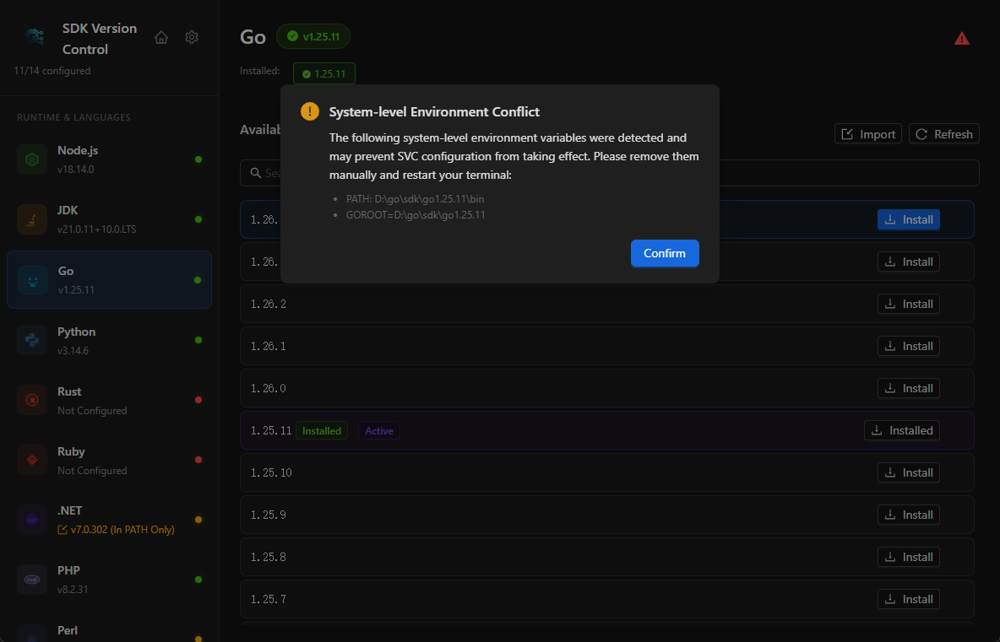
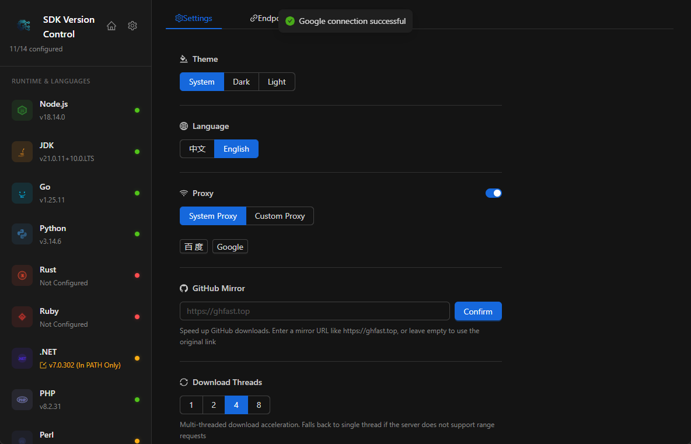

# SDK Version Control

A cross-platform desktop application for unified management of multiple SDK versions (Node.js, JDK, Go, Python, Rust, etc.), including installation, switching, and environment variable configuration.

[Chinese Documentation](README.ZH_CN.md)

## Features

### SDK Management
- **18 SDKs Supported**: Node.js, JDK, Go, Python, Rust, Ruby, .NET, PHP, Perl, Maven, Gradle, Flutter, Android, Dart, and more
- **One-Click Install**: Fetch available versions from official sources and install with one click
- **Version Switching**: Quickly switch between installed versions without re-downloading
- **Reinstall**: Overwrite-install existing versions
- **Import**: Import SDKs from local archives or folders

### Package Managers
- Auto-detect and install corresponding package managers (npm, yarn, pnpm, pip, gem, cargo, etc.)
- Support package manager version updates

### Environment Configuration
- **Auto PATH Management**: Automatically configure system environment variables after install/switch
- **Custom Install Location**: Customize SDK storage directory with automatic PATH migration
- **PATH Viewer**: Visualize SDK-related PATH entries

### System Settings
- **Theme**: Dark / Light / Follow System, with synchronized window title bar
- **i18n**: Chinese / English
- **Proxy**: System proxy or custom proxy support
- **Custom Endpoints**: Configure custom download endpoints per SDK
- **Auto Update**: In-app updates via OSS-hosted version.json

### User Experience
- **Download Progress**: Real-time speed, progress, and size display
- **Copy Download URL**: Copy SDK download links
- **Confirmation Dialogs**: Sensitive operations (version switch, reinstall, migration) require confirmation
- **Status Indicators**: Colored dots in sidebar (green=configured, yellow=PATH only, red=not configured)


### For use
#### HomePage

#### Node.js

#### Jdk

#### download

#### svc warning

#### setting


## Comparison with Alternatives

| Feature | SVC (This Project) | nvm / sdkman / pyenv etc. | VS Code Plugins |
|---|:---:|:---:|:---:|
| Unified SDK management (18+ types) | ✅ | ❌ Single SDK per tool | ❌ Scattered |
| Graphical user interface | ✅ | ❌ CLI only | ✅ |
| Auto PATH configuration | ✅ | ⚠️ Requires shell setup | ❌ |
| Cross-platform desktop app | ✅ | ✅ | ✅ |
| Multi-threaded download | ✅ | ❌ | – |
| Custom download endpoints | ✅ | ⚠️ Partial support | – |
| Package manager companion | ✅ | ⚠️ Partial support | – |
| PATH visualization | ✅ | ❌ | ❌ |
| One-click SDK import (archive/folder) | ✅ | ❌ | ❌ |
| Install path migration with backup | ✅ | ❌ | ❌ |
| System-wide (works with all IDEs/terminals) | ✅ | ⚠️ Shell-scoped | ❌ VS Code only |
| Conflict detection & cleanup | ✅ | ❌ | ❌ |

### Summary

The core advantage of this project lies in its **"one-stop, graphical, cross-platform"** SDK version management experience. It solves the pain point of developers having to install and manage multiple SDK versions by unifying what previously required multiple command-line tools (nvm, sdkman, pyenv, rustup, etc.) into a single, intuitive desktop application.

No more memorizing CLI commands for each language, no more fiddling with shell config files, no more PATH bloat — just a clean GUI that works consistently across Windows, macOS, and Linux.

## Tech Stack

- **Backend**: Go 1.25 + Wails v2
- **Frontend**: React + TypeScript + Vite + Ant Design
- **Desktop**: Wails v2 (WebView2)

## Project Structure

```
sdk_version_control/
├── main.go                    # Entry point
├── app.go                     # Wails App bindings
├── about.json                 # App metadata (version, license, etc.)
├── internal/
│   ├── config/                # Configuration management (settings, install path)
│   ├── downloader/            # HTTP downloader (proxy support)
│   ├── extractor/             # Archive extraction (zip, tar.gz, 7z, etc.)
│   ├── pathmgr/               # PATH environment variable management
│   └── sdk/                   # Version fetching & installation per SDK
├── frontend/
│   ├── src/
│   │   ├── App.tsx            # Main component
│   │   ├── components/        # Sidebar, DetailPanel, Settings, etc.
│   │   ├── i18n/              # Internationalization files
│   │   └── types/             # TypeScript type definitions
│   └── wailsjs/               # Auto-generated Wails bindings
└── build/                     # Build artifacts
```

## Data Storage

- **SDK Install Directory**: Default `~/.svc/` (customizable), structure: `~/.svc/{sdk-type}/{version}/`
- **App Config**: `~/.svc/settings.json` (theme, language, proxy, endpoints, etc.)

## Development

### Prerequisites
- Go 1.25+
- Node.js 18+
- Wails CLI: `go install github.com/wailsapp/wails/v2/cmd/wails@latest`

### Start Dev Server

```bash
wails dev
```

### Build

```bash
# Current platform
wails build

# Custom output filename
wails build -o SDKVersionControl.exe
```

### Cross-Platform Build

Wails v2 does not support cross-compilation. Build on each target platform:

**Windows:**
```bash
wails build
```

**macOS:**
```bash
brew install wailsio/wails/wails
wails build
```

**Linux (Ubuntu/Debian):**
```bash
sudo apt install libgtk-3-dev libwebkit2gtk-4.0-dev
wails build
```

## Auto Update Mechanism

Maintain a `version.json` on your object storage:

```json
{
  "version": "0.2.0",
  "changelog": "1. Added new feature\n2. Fixed bug",
  "downloads": {
    "windows-amd64": {
      "url": "https://bucket.oss.com/releases/app_0.2.0_windows_amd64.exe",
      "filename": "app_0.2.0_windows_amd64.exe"
    },
    "darwin-amd64": { "url": "...", "filename": "..." },
    "darwin-arm64": { "url": "...", "filename": "..." },
    "linux-amd64": { "url": "...", "filename": "..." }
  }
}
```

Click "Check for Updates" in-app to detect new versions, with support for in-app download and automatic restart to apply the update.

## License

MIT License
