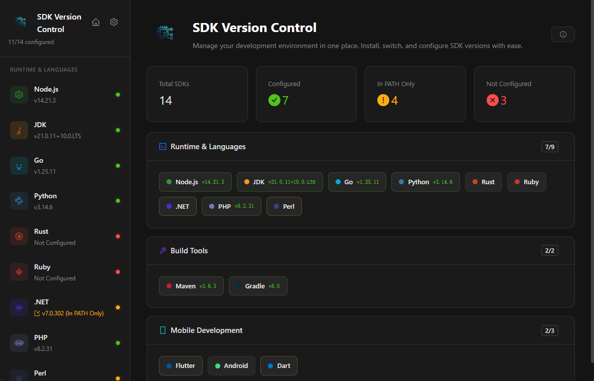
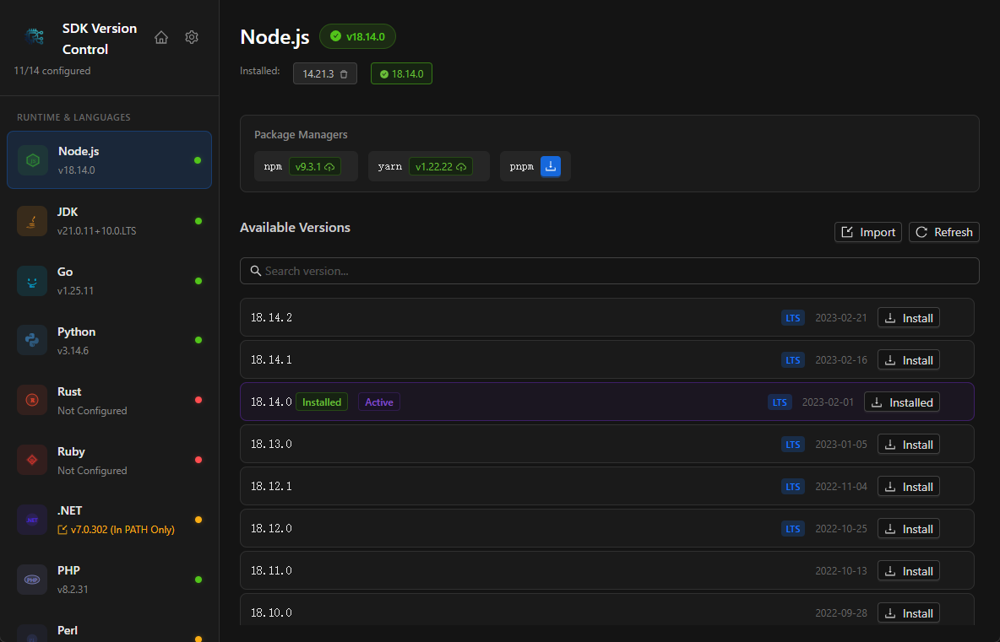
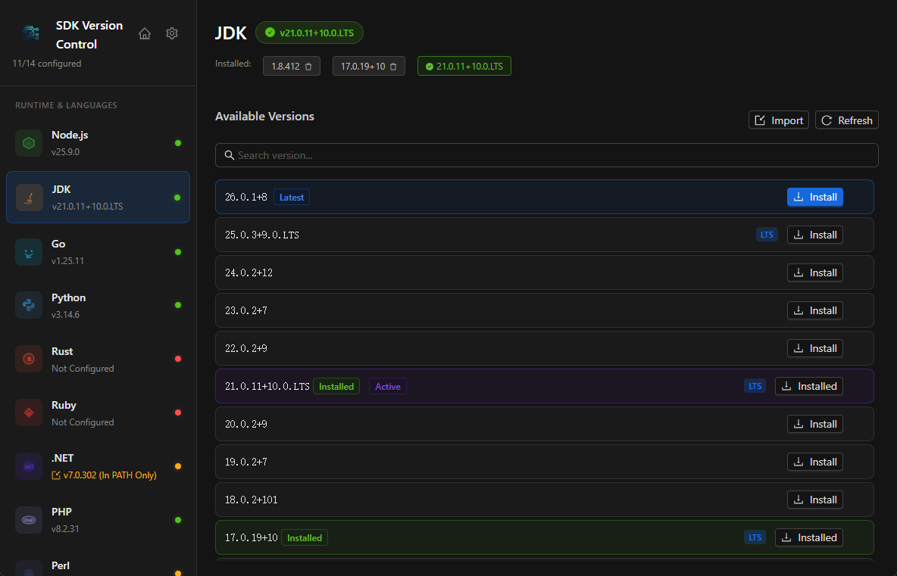
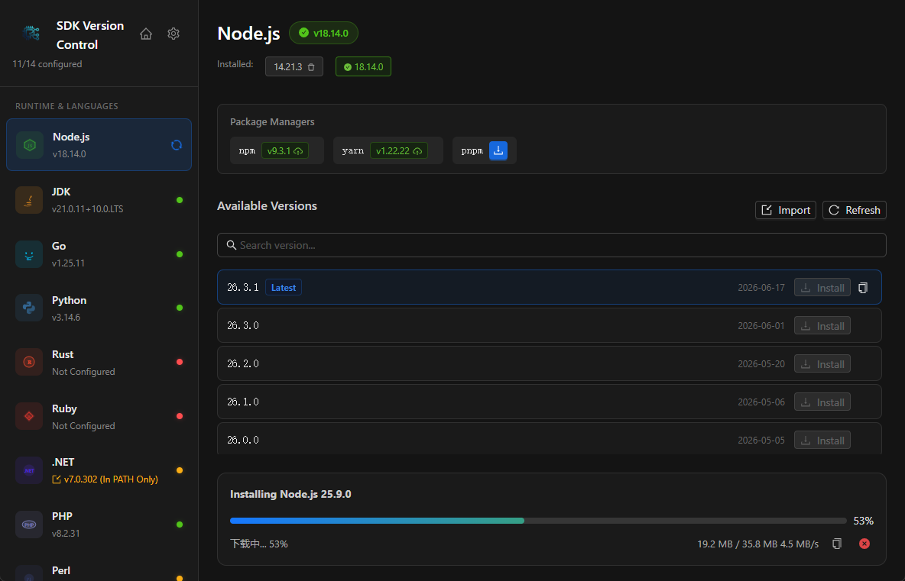
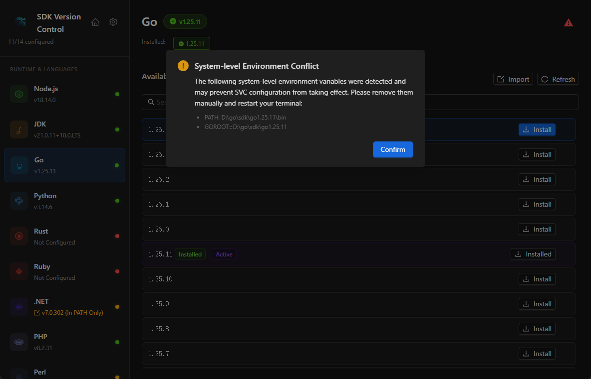
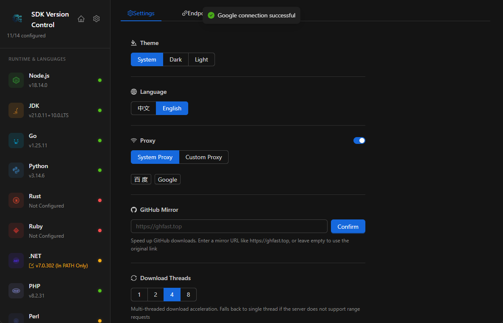

# SDK Version Control

A cross-platform desktop application for unified management of multiple SDK versions (Node.js, JDK, Go, Python, Rust, etc.), including installation, switching, environment variable configuration, and self-update with integrity verification.

[Chinese Documentation](README.ZH_CN.md)

## Features

### SDK Management
- **18 SDKs Supported**: Node.js, JDK, Go, Python, Rust, Ruby, .NET, PHP, Perl, Maven, Gradle, Flutter, Android, Dart, and more
- **One-Click Install**: Fetch available versions from official sources and install with one click
- **Version Switching**: Quickly switch between installed versions without re-downloading
- **Reinstall**: Overwrite-install existing versions
- **Import**: Import SDKs from local archives or folders, or one-click import SDKs detected in PATH

### Shim Mechanism
- Auto-generates shims for SDKs with multi-bin directories (e.g. Rust `cargo/bin` + `rustc/bin`)
- Transparently routes commands to the active version without polluting PATH
- Cross-platform shim executor (Unix shell script + Windows batch)

### Package Managers
- Auto-detect and install corresponding package managers (npm, yarn, pnpm, pip, gem, cargo, etc.)
- Support package manager version updates

### Environment Configuration
- **Auto PATH Management**: Automatically configure system environment variables after install/switch
- **Custom Install Location**: Customize SDK storage directory with automatic PATH migration and desktop backup
- **PATH Viewer**: Visualize SDK-related PATH entries and detect conflicts with system-level env vars
- **Shell RC Editing**: Auto-edits `.bashrc`/`.zshrc`/`.profile`/PowerShell profile to make shims take effect

### System Settings
- **Theme**: Dark / Light / Follow System, with synchronized window title bar
- **i18n**: Chinese / English
- **Proxy**: System proxy or custom proxy support, with connection testing (Baidu / Google)
- **GitHub Mirror**: Speed up GitHub downloads via configurable mirror (e.g. `https://ghfast.top`)
- **Download Threads**: Multi-threaded segmented download with automatic single-thread fallback
- **Custom Endpoints**: Configure custom download endpoints per SDK
- **Cache Cleanup**: One-click cleanup of temporary download cache and inactive SDK versions
- **Log Management**: View, search, and clean application logs in-app

### Self-Update (since v1.0.0)
- **GitHub Releases**: Detect, download, and apply updates entirely in-app — no manual reinstall needed
- **SHA256 Verification**: Every downloaded binary is verified against the published checksum before being swapped in; corrupt or tampered payloads are rejected and deleted
- **One-Shot Rollback**: Each upgrade backs up the previous binary to `<exe>.bak`; the in-app "Rollback" button restores the immediately previous version
- **Cross-Platform Replace**: Unix uses a shell script (`pgrep` wait → backup → replace → relaunch); Windows uses a batch script (`tasklist` wait → backup → replace → relaunch) to handle running-binary locks
- **Asset Naming**: `SDKVersionControl-{version}-{os}-{arch}.{ext}` (amd64 → x64), with a standalone `sha256sums.txt` shipped per release

### User Experience
- **Download Progress**: Real-time speed, progress, and size display
- **Copy Download URL**: Copy SDK download links
- **Confirmation Dialogs**: Sensitive operations (version switch, reinstall, migration, rollback) require confirmation
- **Status Indicators**: Colored dots in sidebar (green=configured, yellow=PATH only, red=not configured)

### Screenshots
#### HomePage

#### Node.js

#### Jdk

#### download

#### svc warning

#### setting


## Comparison with Alternatives

| Feature | SVC (This Project) | nvm / sdkman / pyenv etc. | VS Code Plugins |
|---|:---:|:---:|:---:|
| Unified SDK management (18+ types) | ✅ | ❌ Single SDK per tool | ❌ Scattered |
| Graphical user interface | ✅ | ❌ CLI only | ✅ |
| Auto PATH configuration | ✅ | ⚠️ Requires shell setup | ❌ |
| Cross-platform desktop app | ✅ | ✅ | ✅ |
| Multi-threaded download | ✅ | ❌ | – |
| Custom download endpoints | ✅ | ⚠️ Partial support | – |
| GitHub mirror acceleration | ✅ | ❌ | – |
| Package manager companion | ✅ | ⚠️ Partial support | – |
| PATH visualization | ✅ | ❌ | ❌ |
| One-click SDK import (archive/folder/PATH) | ✅ | ❌ | ❌ |
| Shim mechanism for multi-bin SDKs | ✅ | ❌ | ❌ |
| Install path migration with backup | ✅ | ❌ | ❌ |
| System-wide (works with all IDEs/terminals) | ✅ | ⚠️ Shell-scoped | ❌ VS Code only |
| Conflict detection & cleanup | ✅ | ❌ | ❌ |
| In-app self-update with SHA256 + rollback | ✅ | ⚠️ Partial (no rollback) | ❌ |

### Summary

The core advantage of this project lies in its **"one-stop, graphical, cross-platform"** SDK version management experience. It solves the pain point of developers having to install and manage multiple SDK versions by unifying what previously required multiple command-line tools (nvm, sdkman, pyenv, rustup, etc.) into a single, intuitive desktop application.

No more memorizing CLI commands for each language, no more fiddling with shell config files, no more PATH bloat — just a clean GUI that works consistently across Windows, macOS, and Linux.

## Tech Stack

- **Backend**: Go 1.25 + Wails v2
- **Frontend**: React + TypeScript + Vite + Ant Design
- **Desktop**: Wails v2 (WebView2 / WebKitGTK)

## Project Structure

```
sdk_version_control/
├── main.go                    # Entry point
├── app.go                     # Wails App bindings
├── about.json                 # App metadata (version, license, updateUrl)
├── update.go                  # Update check + download + SHA256 verify
├── update_unix.go             # Unix binary replace + rollback (.bak)
├── update_windows.go          # Windows binary replace + rollback (.bak)
├── sdk_ops.go                 # SDK install/switch/uninstall operations
├── import_sdk.go              # SDK import from archive/folder/PATH
├── migration.go               # Install-path migration with desktop backup
├── pkgmgr.go                  # Package manager detection & install
├── storage.go                 # Cache size + inactive version cleanup
├── logmgr.go                  # Log file management
├── proxy.go                   # Proxy transport builder
├── helpers.go                 # Misc helpers
├── cmd_unix.go / cmd_windows.go  # Cross-platform cmd launcher
├── internal/
│   ├── config/                # Settings, install path, shell detection
│   ├── downloader/            # Multi-threaded HTTP downloader (proxy support)
│   ├── extractor/             # Archive extraction (zip, tar.gz, 7z, etc.)
│   ├── logger/                # Structured logging
│   ├── pathmgr/               # PATH env management (unix/windows)
│   ├── shim/                  # Shim executor + arg detection
│   ├── shimmanager/           # Shim install + shell RC editing
│   └── sdk/                   # Version fetching & installation per SDK
├── frontend/
│   ├── src/
│   │   ├── App.tsx            # Main component
│   │   ├── components/        # Sidebar, DetailPanel, Settings, etc.
│   │   ├── i18n/              # en / zh translation files
│   │   └── types/             # TypeScript type definitions
│   └── wailsjs/               # Auto-generated Wails bindings
├── winres/                    # Windows resource (icon, manifest)
├── .github/workflows/
│   ├── ci.yml                 # lint + test + commit-lint on PR
│   └── build.yml              # 6-platform build + release on tag push
└── version.json.example       # Sample version.json for self-update
```

## Data Storage

- **SDK Install Directory**: Default `~/.svc/` (customizable), structure: `~/.svc/{sdk-type}/{version}/`
- **Shim Directory**: `~/.svc/shims/` (added to PATH; routes to active versions)
- **App Config**: `~/.svc/settings.json` (theme, language, proxy, endpoints, etc.)
- **Logs**: `~/.svc/logs/`
- **Update Backup**: `<exe>.bak` next to the running binary (created on each upgrade)

## Development

### Prerequisites
- Go 1.25+
- Node.js 18+
- Wails CLI: `go install github.com/wailsapp/wails/v2/cmd/wails@latest`
- Linux only: `libgtk-3-dev libwebkit2gtk-4.0-dev libayatana-appindicator3-dev librsvg2-dev`

### Start Dev Server

```bash
wails dev
```

### Build

```bash
# Current platform
wails build

# Custom output filename
wails build -o SDKVersionControl
```

### Cross-Platform Build Notes

Wails v2 cannot cross-compile Linux (CGO links webkit2gtk/gtk) — use a native runner for Linux ARM64. Windows ARM64 and macOS ARM64 can be cross-compiled on amd64 runners (no CGO). The CI workflow in [.github/workflows/build.yml](.github/workflows/build.yml) handles all six targets automatically on tag push.

## Installation

Download the latest release for your platform from [Releases](https://github.com/mose-x/sdk-version-control/releases/latest):

| Platform | Asset |
|---|---|
| Windows x64 | `SDKVersionControl-{ver}-windows-x64.exe` |
| Windows arm64 | `SDKVersionControl-{ver}-windows-arm64.exe` |
| macOS x64 | `SDKVersionControl-{ver}-macos-x64.dmg` |
| macOS arm64 (Apple Silicon) | `SDKVersionControl-{ver}-macos-arm64.dmg` |
| Linux x64 | `SDKVersionControl-{ver}-linux-x64` |
| Linux arm64 | `SDKVersionControl-{ver}-linux-arm64` |

Verify integrity with the published checksums:

```bash
sha256sum -c sha256sums.txt --ignore-missing
```

## Self-Update Mechanism

The app checks `https://github.com/mose-x/sdk-version-control/releases/latest/download/version.json` (configured in [about.json](about.json)). Each release ships a `version.json` describing per-platform download URLs and SHA256 checksums, plus a standalone `sha256sums.txt`.

### Update Flow

1. **Check**: In-app "Check for Updates" fetches `version.json` and compares versions semantically.
2. **Download**: User clicks "Download & Install"; the new binary is downloaded to a temp path with real-time progress, applying the configured GitHub mirror and proxy.
3. **Verify**: SHA256 of the downloaded file is computed and compared against the value in `version.json`. On mismatch the temp file is deleted and the update aborts (defense against CDN tampering or partial downloads).
4. **Apply**: A shell/batch script is spawned that waits for the app to exit, backs up the current binary to `<exe>.bak`, replaces it with the new one, and relaunches.
5. **Rollback** (optional): If the new version misbehaves, "Rollback" in Settings restores `<exe>.bak` via the same wait-replace-relaunch pattern. One-shot — `.bak` always holds the immediately previous version.

### version.json Schema

See [version.json.example](version.json.example) for a full sample. The `downloads` map keys are `<runtime.GOOS>-<runtime.GOARCH>` (e.g. `windows-amd64`, `darwin-arm64`) — Go's GOARCH is `amd64`, not `x64`, even though the asset filename uses `x64`.

```json
{
  "version": "1.0.0",
  "changelog": "Release v1.0.0 — see ... for details",
  "downloads": {
    "windows-amd64": {
      "url": ".../SDKVersionControl-1.0.0-windows-x64.exe",
      "filename": "SDKVersionControl-1.0.0-windows-x64.exe",
      "sha256": "abc123..."
    },
    "darwin-arm64": {
      "url": ".../SDKVersionControl-1.0.0-macos-arm64.bin",
      "filename": "SDKVersionControl",
      "sha256": "def456..."
    }
  }
}
```

> macOS uses the `.bin` (bare executable) for self-update because `ApplyUpdate` replaces the binary inside the `.app` bundle, not the bundle itself. The `.dmg` is for manual install only.

### Release a New Version

CI is fully automated — just push a tag:

```bash
git tag v1.1.0
git push origin v1.1.0
```

The [build.yml](.github/workflows/build.yml) workflow will build all six platform assets, generate `sha256sums.txt` and `version.json`, and publish a non-draft GitHub Release. The in-app updater picks it up immediately via `releases/latest/download/version.json`.

## License

MIT License
